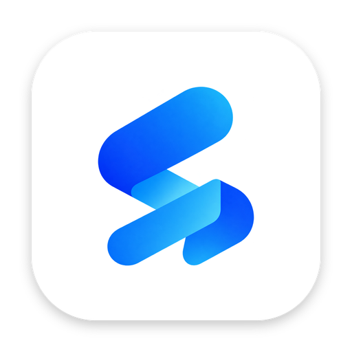
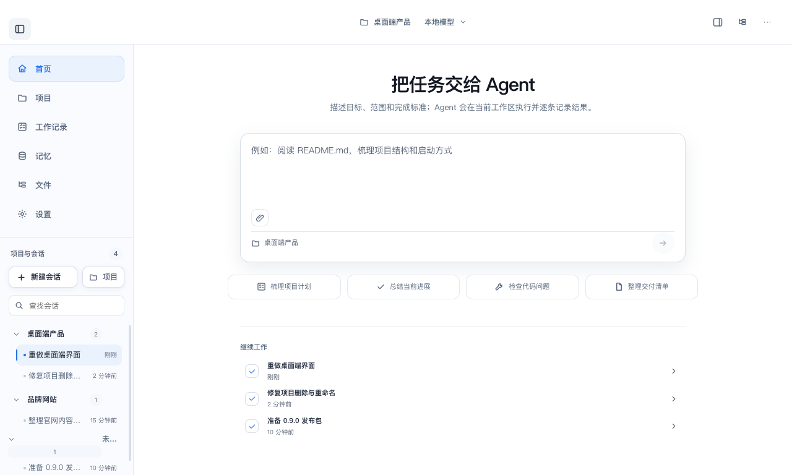
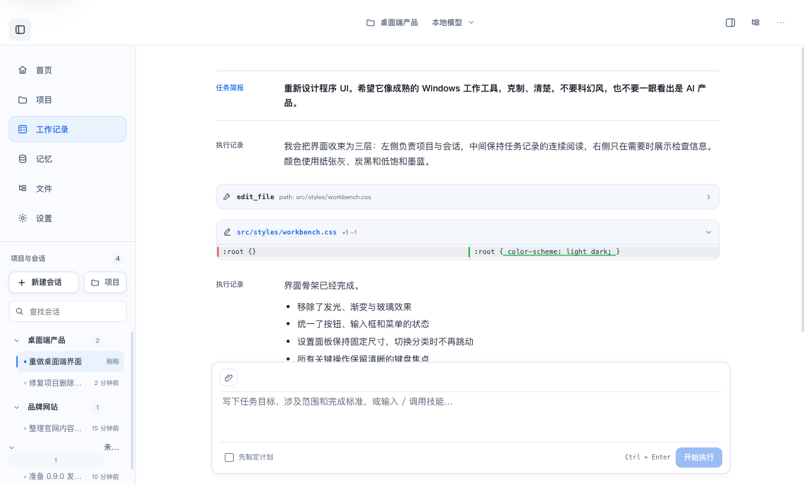
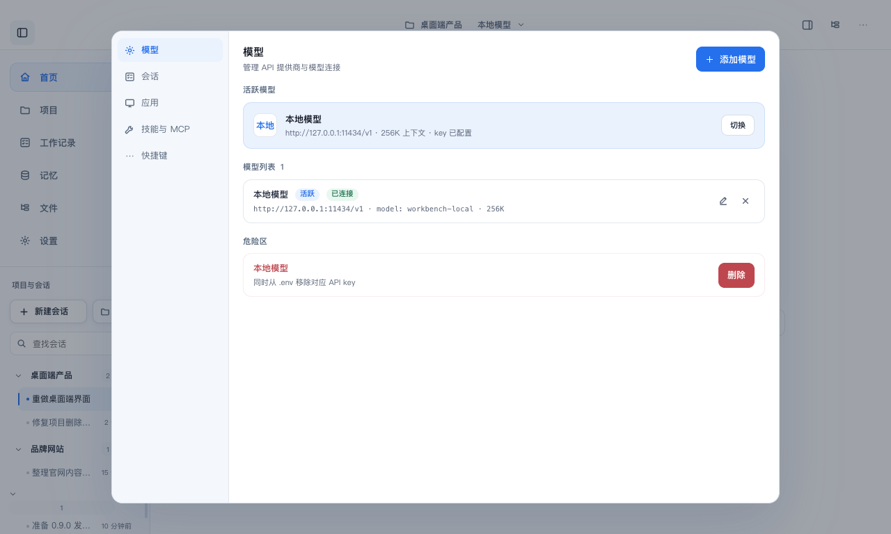

<p align="center">
  
</p>

<h1 align="center">Stellara Work</h1>

<p align="center">
  <strong>ローカルファーストのCodexスタイルデスクトップエージェント</strong>（Windows・macOS対応）。<br/>
  OpenAI互換APIキーをご利用ください — すべてのデータはお手元のマシンに残ります。
</p>

<p align="center">
  <a href="../../README.md">English</a> · <a href="README_zh-TW.md">繁體中文</a> · <a href="README_ru.md">Русский</a> · <a href="README_fr.md">Français</a> · <a href="README_de.md">Deutsch</a> · <a href="README_es.md">Español</a> · <a href="README_pt-BR.md">Português</a> · <a href="README_ja.md">日本語</a> · <a href="README_ko.md">한국어</a> · <a href="README_ar.md">العربية</a>
</p>

---

**Stellara Work**は**ローカルファースト**のデスクトップエージェントで、個人的なCodexのように動作します。OpenAI互換のAPIキー（`base_url + api_key`）をご用意いただき、デスクトップワークベンチでエージェントと協力してコーディングタスク — ファイル読み取り、コード編集、コマンド実行 — をすべてレビュー・承認可能に行えます。

APIキー、セッション、ファイル、設定は**決してお手元のマシンから離れません**。Stellara Workは外部サーバーにデータを送信しません。

---

## 主な機能

| | 機能 | 説明 |
|---|---|---|
| 🔒 | **ローカルプライバシー優先** | APIキーはシステムキーチェーン（macOS）/ DPAPI（Windows）で暗号化；すべてのデータはローカルに保存 |
| 🧠 | **モデル持ち込み** | 任意のOpenAI互換エンドポイントに対応；GLM、DeepSeek、Kimi、MiniMaxのプリセット内蔵；カスタムモデル無制限 |
| ✅ | **プランモード + 承認ゲート** | ファイル書き込み、コマンド実行の都度、明示的な承認が必要 |
| 💬 | **ストリーミング会話** | リアルタイムMarkdownレンダリング、diffビュー、コマンド出力カード |
| 🗂️ | **プロジェクトワークスペース** | 任意のフォルダを指定；エージェントが実際のコードで読み書き・検証 |
| 🧰 | **スキルとMCP** | カスタムスキルとMCPサーバーでエージェントの能力を拡張 |
| 🧠 | **メモリーセンター** | セッション間で持続的かつ検索可能なメモリー |
| 📎 | **添付ファイル** | 任意のセッションでファイルや画像をドラッグ＆ドロップ |
| 📂 | **ファイルマネージャー** | サイドバーのファイルツリー、新規ファイル/フォルダ作成対応 |
| 🎨 | **デザインシステム** | 統一されたUIスタイル変数とワークベンチデザイン |

---

## スクリーンショット

| ホーム | チャット | 設定 |
|:---:|:---:|:---:|
|  |  |  |

---

## ダウンロード

**最新バージョン：v0.9.1**

| プラットフォーム | インストーラー |
|---|---|
| macOS (Apple Silicon) | [Stellara Work-0.9.1-arm64.dmg](https://github.com/strashineltd/stellara-work/releases/latest) |
| Windows (x64) | [Stellara Work-Setup-0.9.1.exe](https://github.com/strashineltd/stellara-work/releases/latest) |

> **注意：** 現在のインストーラーには署名がありません。macOSでは右クリック→「開く」；WindowsではSmartScreenで「詳細情報→実行」を選択してください。

---

## クイックスタート

### 前提条件

- Node.js 20+
- Windows：Python 3.x + Visual Studio Build Tools（デスクトップ開発用C++）— 初回の`npm install`時にのみ必要
- macOS / Linux：追加インストール不要

### 1. 依存関係のインストール

```bash
npm install
```

macOS/Linuxでは`bash setup.sh`を使用できます（Nodeの確認、依存関係のインストール、テストの実行）。

### 2. 起動

```bash
npm run dev
```

初回起動時にガイドに従ってモデルを選択し、APIキーを入力してください。キーは暗号化して保存され、メインプロセスのみがアクセスできます。

### 3. よく使うスクリプト

```bash
npm run dev          # 開発モード（Vite HMR + Electron）
npm test             # テストの実行
npm run typecheck    # 両プロセスの型チェック
npm run package:mac  # macOS用dmg/zipのビルド（macOSのみ）
npm run package:win  # Windows用NSISインストーラーのビルド
```

---

## 内蔵モデルプリセット

| モデル | プロバイダー | base_url |
|---|---|---|
| GLM-5.2 | ZhiPu AI | `https://open.bigmodel.cn/api/paas/v4` |
| DeepSeek-v4-Pro | DeepSeek | `https://api.deepseek.com` |
| Kimi-K3 | Moonshot | `https://api.moonshot.cn` |
| MiniMax-M3 | MiniMax | `https://api.minimaxi.com/v1` |
| カスタム | お客様の | 任意のOpenAI互換エンドポイント |

---

## セキュリティモデル

- `nodeIntegration: false` — レンダリングプロセスは`require('fs')`を使用できません
- `contextIsolation: true` — レンダリングプロセスのJSはプリロードから分離されています
- `sandbox: true` — レンダリングプロセスはサンドボックス内で実行されます
- 外部URLは`http/https/mailto`プロトコルに制限されます
- すべてのIPCハンドラーは送信元を検証します
- すべての危険な操作（ファイル書き込み、コマンド実行）は明示的な承認が必要です

---

## アーキテクチャ

```
electron/                  # Electronメインプロセス
├── main.ts                # エントリーポイント + IPCハンドラー
├── preload.ts             # contextBridge API
├── agent/                 # エージェントループ、プランニング、ツール（fs / shell / grep / git）
├── llm/                   # OpenAI互換クライアント + SSEストリーミング
├── memory/                # 永続メモリストレージ
└── config/                # 暗号化キーストレージ（safeStorage）
src/                       # Reactレンダリングプロセス
├── components/            # チャット、プランカード、設定、ガイド、ホーム
├── styles/                # デザイン変数 + ワークベンチCSS
└── lib/                   # レンダリングプロセスユーティリティ
shared/                    # プロセス間で共有されるIPCコントラクト
```

技術スタック：Electron · React 19 · TypeScript · Vite · better-sqlite3 · CodeMirror 6

---

## ドキュメント

- [macOS移行ガイド](../macos-migration.md)
- [コントリビューションガイド](../../CONTRIBUTING.md)
- [変更履歴](../../CHANGELOG.md)

---

## ライセンス

[MIT](../../LICENSE) © Stellara Work